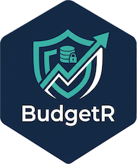

**BudgetR** is a comprehensive financial simulation and portfolio management dashboard built with R Shiny. It bridges the "Retail Data Gap" by leveraging **Tiller Money** and **Google Sheets** to ingest real-time brokerage data, and then empowers you to run advanced statistical models—from Monte Carlo simulations to Deep Learning—on your own finances.

## 🚀 Key Features

### 📊 Portfolio Management

- **Tiller Sync Integration**: Automatically pull your latest brokerage balances (Edward Jones, Fidelity, etc.) from Google Sheets into a local high-performance **DuckDB** database.
- **Asset Allocation**: visualize your current holdings and asset distribution.

### 🎯 Projects & Goal Simulations

- **Scenario Planning**: Create specific financial goals (e.g., "Tesla Model 3 in 5 years", "Child's College Fund").
- **Smart Math**: Automatically calculates the **required monthly contribution** needed to hit your target, accounting for compound interest and current savings.

### 🔮 Advanced Forecasting

- **Monte Carlo Simulations**: Run thousands of stochastic simulations to see the probability of your portfolio growth over 10, 20, or 40 years.
- **Stock Analysis**: Deep dive into individual tickers (e.g., SPY, QQQ) with historical performance metrics.

### 🧠 Deep Learning & Statistics

- **GARCH Models**: Model volatility clustering to predict risk cones and confidence intervals.
- **Neural Networks**: Train **LSTM** (Long Short-Term Memory) and **RNN** models using `torch` to predict future price trends based on historical patterns.
- **Ensemble Learning**: Combine the power of multiple models into a single, robust weighted forecast.

## 🛠️ Tech Stack

- **Frontend**: R Shiny + `bslib` for a modern, responsive UI.
- **Backend**: `DuckDB` + `duckplyr` for lightning-fast SQL queries on local data.
- **Machine Learning**: `torch` (Deep Learning), `rugarch` (GARCH), `timetk` (Time Series).
- **Data Source**: `googlesheets4` (Tiller Connection), `tidyquant` (Market Data).

## 📦 Installation

1. **Clone the Repository**: `bash     git clone https://github.com/yourusername/budgetr.git`

2. **Install R Packages**: Run the following in your R console: `r     install.packages(c(       "shiny", "bslib", "tidyverse", "googlesheets4",        "duckdb", "duckplyr", "tidyquant", "dbplyr",        "rmarkdown", "torch", "rugarch", "timetk"     ))`

3. **Install Torch Backend**: The first time you load the library, it needs to download the LibTorch backend. `r     library(torch)     install_torch()`

## ⚙️ Configuration

1. **Tiller Money Setup**:
    - Sign up for [Tiller Money](https://www.tillerhq.com/).
    - Connect your brokerages.
    - Link Tiller to a Google Sheet.
2. **Connect BudgetR**:
    - Open `global.R`.
    - Replace the `SHEET_URL` variable with your Tiller Google Sheet URL: `r     SHEET_URL <- "https://docs.google.com/spreadsheets/d/YOUR_ACTUAL_ID_HERE"`
3. **Authentication**:
    - Run `googlesheets4::gs4_auth()` once in your local R console to authorize access to your Google Drive.

## 🧪 Testing / Demo Mode

Don't have a Tiller account yet? You can still test the full power of BudgetR using synthetic data.

1. Launch the app.
2. Navigate to the **Data Management** tab.
3. Click **"Load Demo Data (Testing)"**.
4. This generates realistic price history and accumulation for **SPY**, **TLT**, **GLD**, **MSFT**, and **TSLA**.
5. You can now use **Reports** and **Forecasting** as if you had real data connected.

## 🖥️ Usage

Run the app from RStudio:

``` r
shiny::runApp()
```

### Workflow

1. **Sync Data**: Go to the **Data Management** tab and click **"Sync from Google Sheets"**. This populates your local DuckDB.
2. **Plan Goals**: Go to **Projects & Goals** to set up savings targets.
3. **Forecast**: Use **Forecasting** for long-term portfolio Monte Carlo sims.
4. **Analyze**: Use **Advanced Analytics** to train Neural Networks on specific stocks.
5. **Report**: Generate a PDF summary in the **Reports** tab.

## 📄 License

MIT License.
